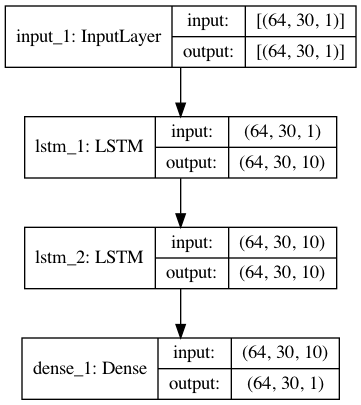

[](http://quantlet.de/)

## [](http://quantlet.de/) **Time_Series_Forecasting_on_Crude_Oil_Price** [](http://quantlet.de/)

```yaml

Name of Quantlet: 'Time_Series_Forecasting_on_Crude_Oil_Price'

Published in: 'SDA_2021_NUS'

Description: 'Project_Group11 file'

Keywords: 'NUS, FE5225,crude oil, price, LSTM'

Author: 'Peng Wenhui, Gui Yilin'

```




### [IPYNB Code: Time_Series_Forecasting_on_Crude_Oil_Price.ipynb](Time_Series_Forecasting_on_Crude_Oil_Price.ipynb)


automatically created on 2021-04-15