[](http://quantlet.de/)

## [](http://quantlet.de/) **WebScraping_Oil_News_Headline_and_Clustering** [](http://quantlet.de/)

```yaml

Name of Quantlet: 'WebScraping_Oil_News_Headline_and_Clustering'

Published in: 'SDA_2021_NUS'

Description: 'Project_Group11 file'

Keywords: 'NUS, FE5225, oil, news, headline, webscraping'

Author: 'Peng Wenhui, Gui Yilin'

```

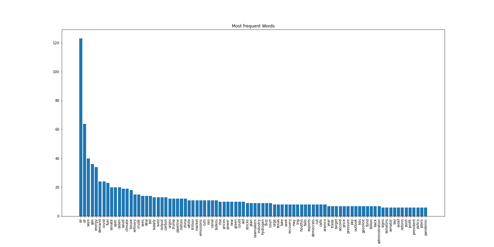

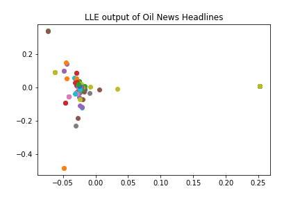

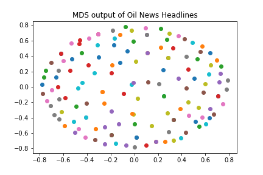

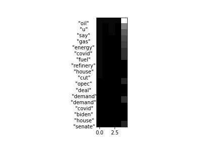

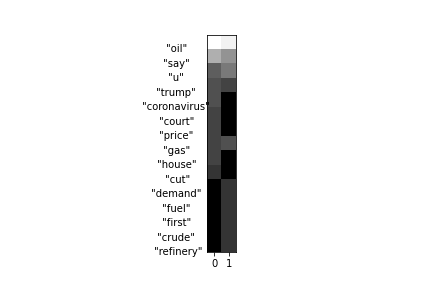


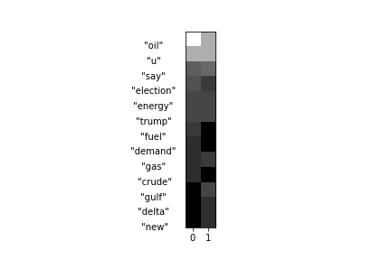

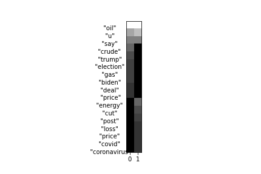

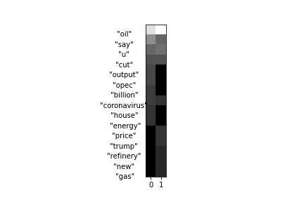

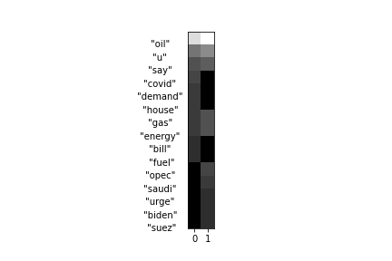

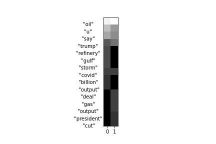

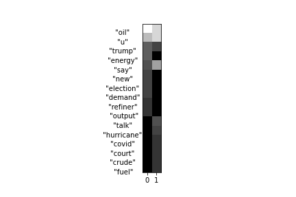

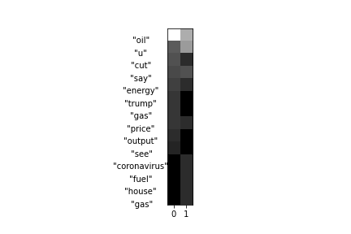

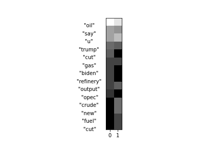

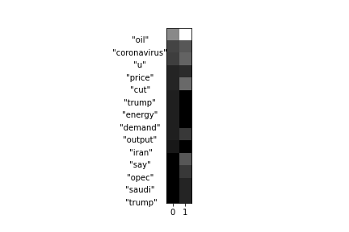

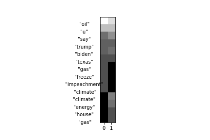

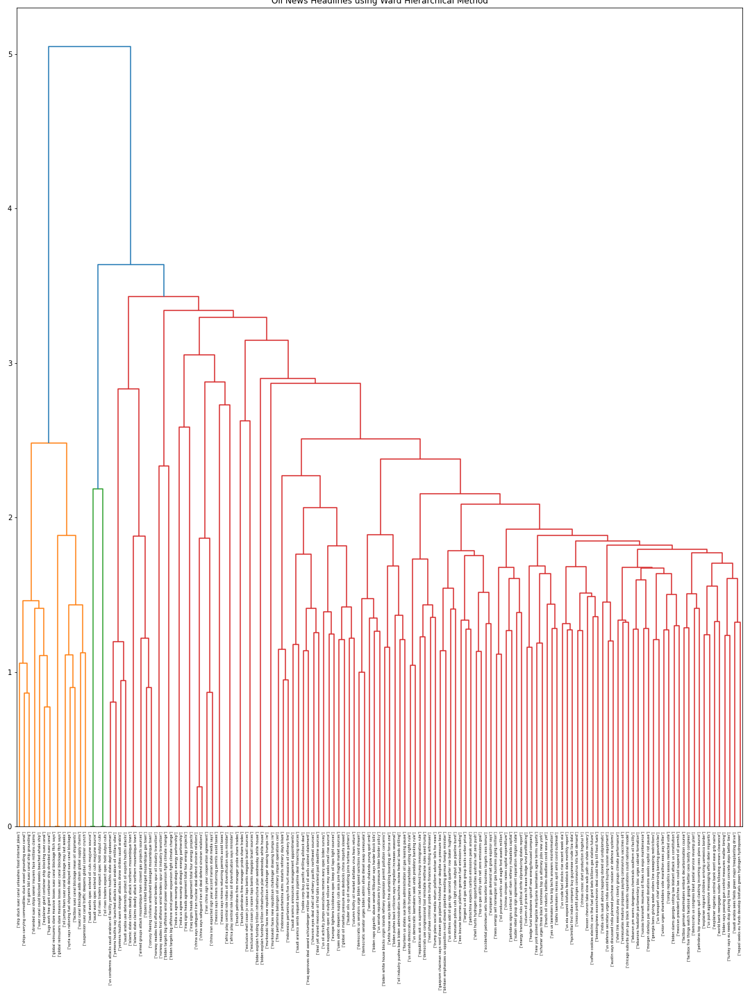

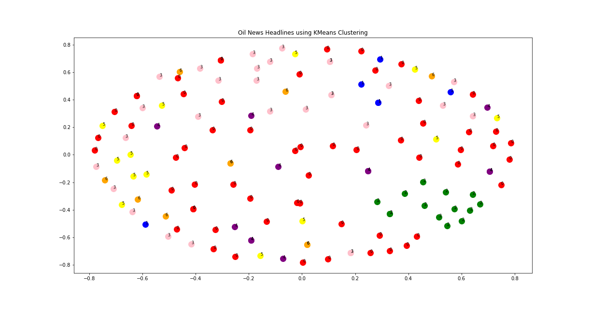

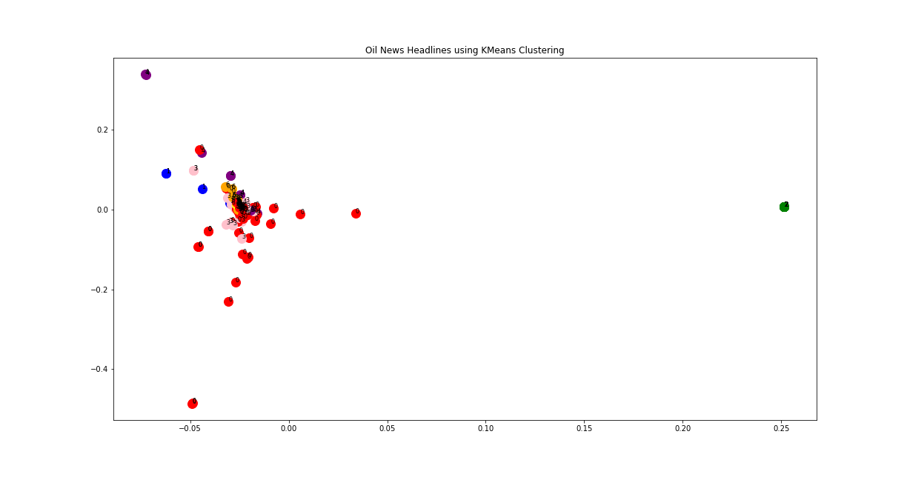

### [IPYNB Code: WebScraping_Oil_News_Headline_and_Clustering.ipynb](WebScraping_Oil_News_Headline_and_Clustering.ipynb)


automatically created on 2021-04-15